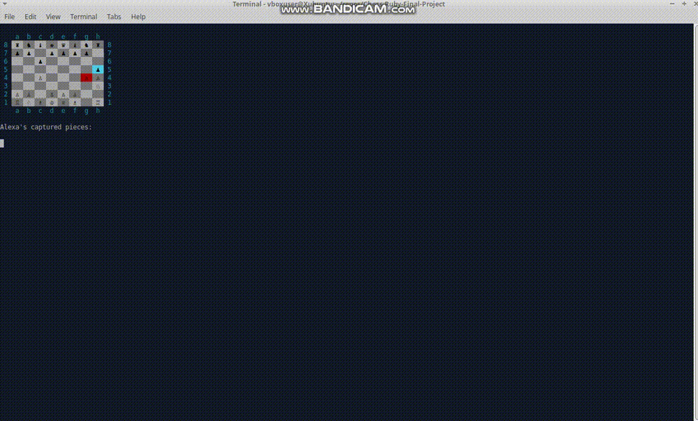

# Chess-Ruby-Final-Project
Chess is a board game for two players, called White and Black, each controlling an army of chess pieces, with the objective to checkmate the opponent's king.

## Demo with AI
 

# CLI Ruby Chess Game
This is the final project in the Ruby curriculum at [The Odin Project](https://www.theodinproject.com/lessons/ruby-ruby-final-project).

## Play Online
If you want to play this chess game without installing it on your computer, you can play it online. Just click the run button at the top of the page. It will take a few seconds to load the dependencies and then the game menu will appear.

## To Play
Run ruby lib/main.rb
Play a 1-player or 2-player game (can save a game to load at a later time)

## Running the tests
To run the entire test suite, run rspec
To run the tests for one file in the spec folder, run rspec spec/file_name.rb
To run the tests for one file in the lib folder, run rspec spec/lib/file_name.rb
To run the tests for one file in the pieces folder, run rspec spec/lib/pieces/file_name.rb

## Reflections

This project was the most challenging and intricate one I've tackled so far. It was tough due to the extensive range of problems that required solving, spanning both depth and breadth. Integrating these diverse solutions in a coherent and adaptable manner posed its own difficulties. Managing the unnecessary bulk and outdated elements resulting from multiple experiments or implementations that needed modification due to unforeseen scenarios was quite a challenge.

While I invested considerable thought in planning the overall design, it was during the actual implementation that many issues surfaced, ones that weren't apparent initially.

I've realized the importance of maintaining modular systems; as the project expanded, the interconnected parts made even minor changes incredibly difficult. Additionally, adhering to rigorous testing practices proved essential for safe refactoring and making alterations.

Despite the challenges, this project was incredibly rewarding, offering a wealth of lessons learned along the way.

